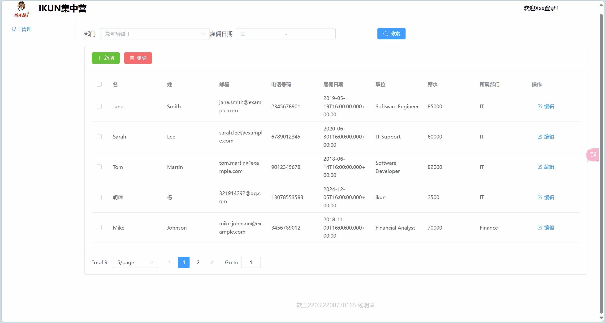
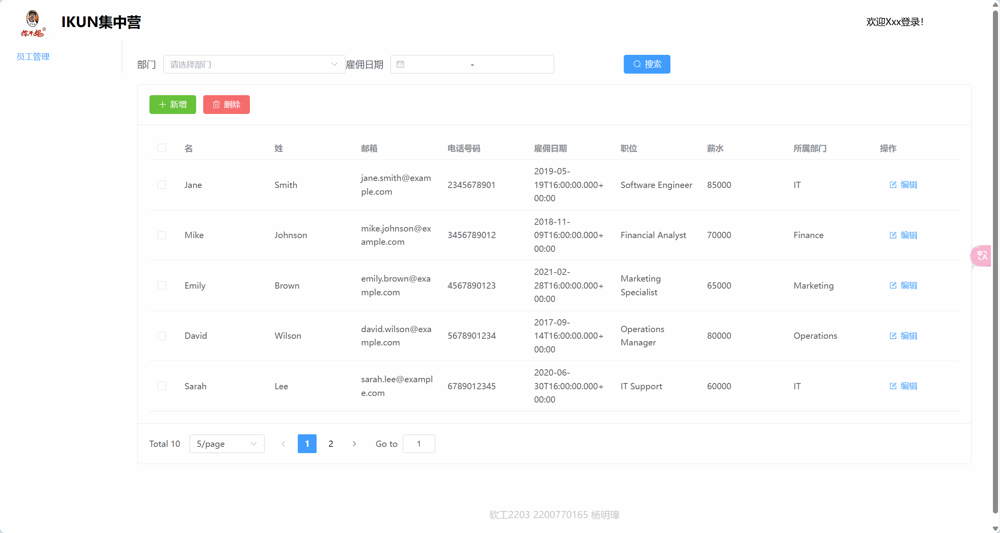
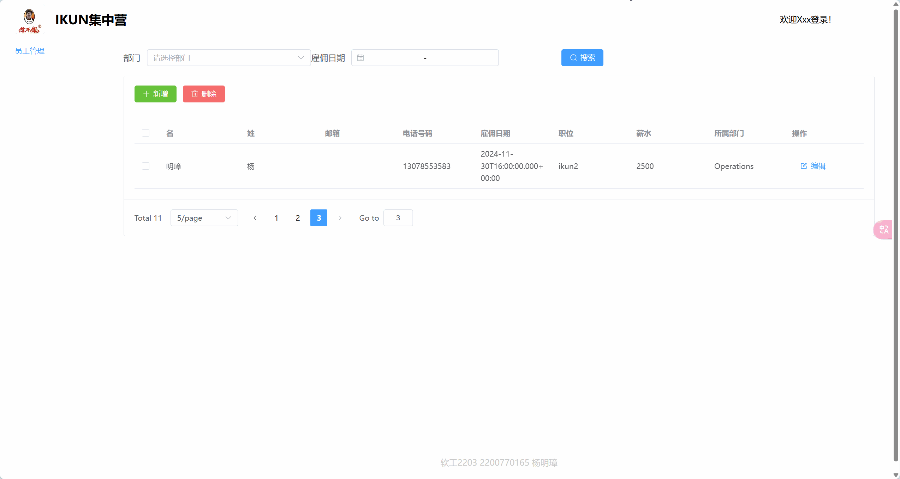
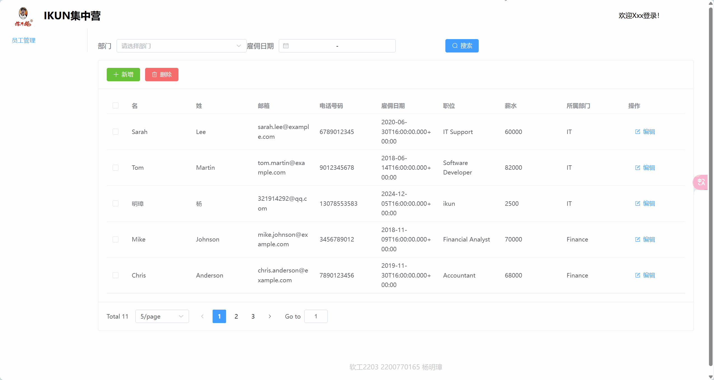

# 开发环境

前端：

node.js v18.20.5

使用的包管理器为pnpm

后端：

MySQL 8.0.40

JDK17

# 前置条件

为保证能对员工表进行正常的CRUD操作，我对原先给定的SQL脚本做了以下修改：

- 移除email字段的Unique约束。
  - 理由：email字段本身应该是可选的。但是因为unique的约束，使得员工中只能有一个人的email字段为null，这不太合理。
- 清空以下表格内的记录：
  - 理由：employee表和上面两张表有外键约束。如果不提前清空这两张表的记录，就不能正常删除员工。

# 功能演示

## 查询

## 添加

## 修改

## 删除

